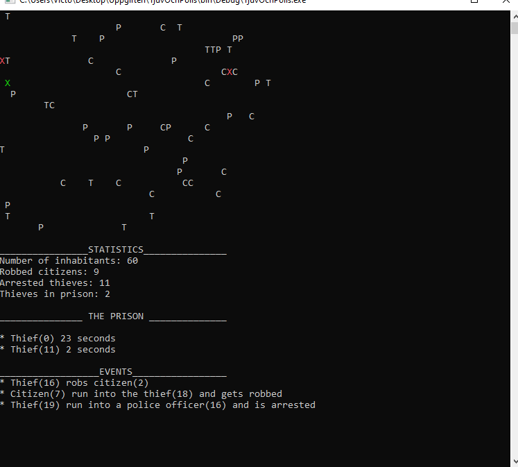

# The Lottery Generator
###### Programming language:
 C#
###### Development environment:
Visual studio community 2019 (.Net FrameWork)
###### Start instructions
* Download the source code
* go folder bin / debug 
* run the Lottery Generator file.

###### Description
Windows Forms application from a small school assignment at Karlstad university (02/10-20) where the task was to simulate a lottery generator. The users has the opportunity to choose their own lottery numbers or if the program should generate these. To run the program, the user must also select the number of game rounds in which the lottery row is to be played. There is also functionality to select payout for different outcomes. The program shows the number of correct rows and any winnings

