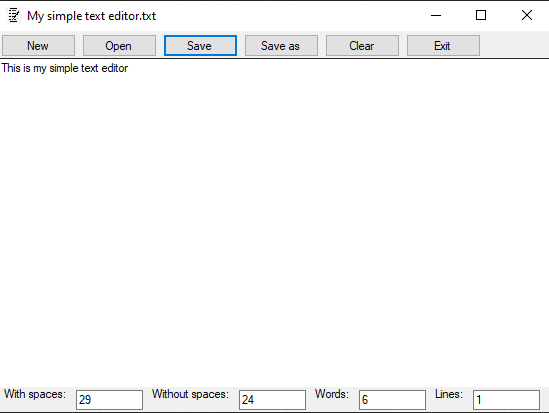

# Simple Text Editor Forms
###### Programming language:
 C#
###### Development environment:
Visual studio community 2019 (.Net Framework)
###### Start instructions
* Download the source code
* go folder bin / debug
* run the exe file.

###### Description
My first Windows Forms application from a small school assignment at Karlstad University (01/10-20) where the task was to create a simple text editor similar to the windows notes application. The text editor has different functionalities and is very self explanatory. It is possible to edit ordinary txt files on your computer, the program also keeps track of how many words and lines your text file has.

***
