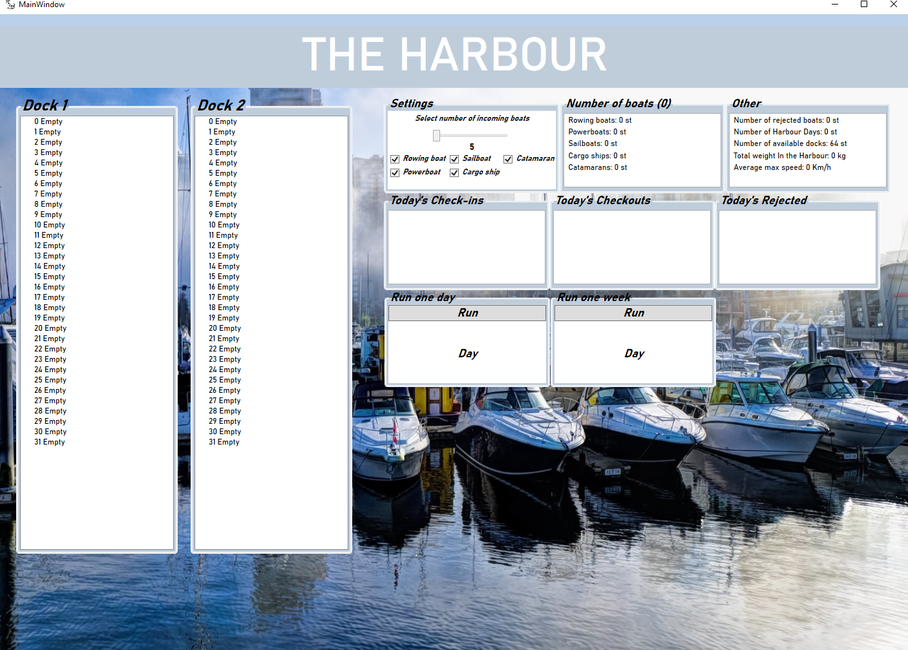
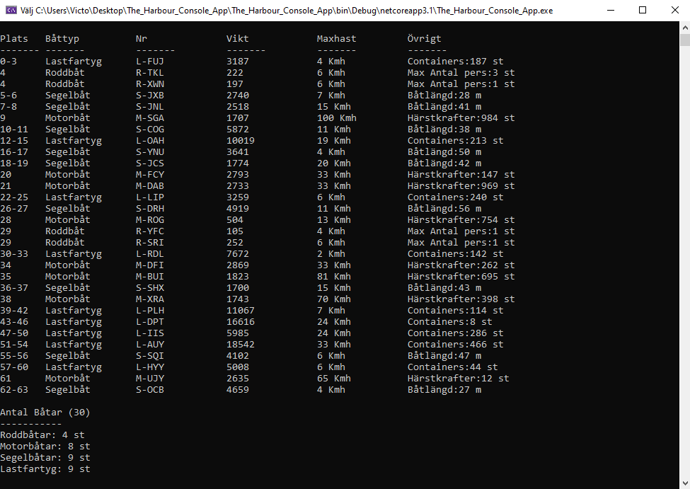

# The Harbour WPF
###### Programming language:
 C#
###### Development environment:
Visual studio community 2019 (.Net Core WPF)
###### Start instructions
* Download the source code
* go folder bin / release / netcoreapp3.1
* run the exe file.

###### Description
My first WPF application from a small school assignment at IT Högskolan (07/11-20) where the task was to simulate a marina with 2 docks. Each dock has 32 berths for incoming boats of various types. Every day boats check in and out from the marina and the program keeps track of the statistics. 

***

# The Harbour Console
###### Programming language:
 C#
###### Development environment:
Visual studio community 2019 (.Net Core WPF)
###### Start instructions
* Download the source code
* go folder bin / release / netcoreapp3.1
* run the exe file.
* press enter to show next day

###### Description
Before the WPF application, I did the task in the console window. Below is an example of what the application looks like.

