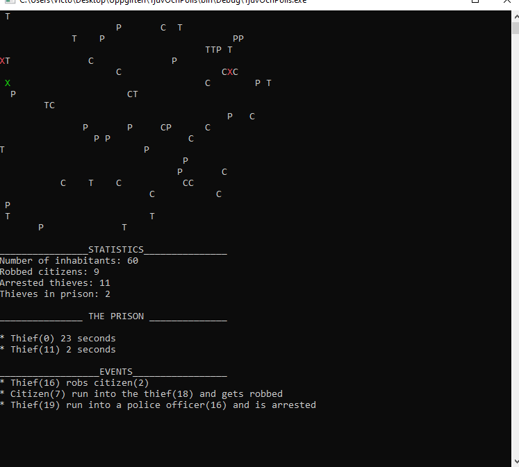

# The Thief And police simulator
###### Programming language:
 C#
###### Development environment:
Visual studio community 2019 (.Net FrameWork)
###### Start instructions
* Download the source code
* go folder bin / debug 
* run the Thief and police file.

###### Description
Console application from a small school assignment at IT Högskolan (07/09-20) where the task was to simulate a city with different inhabitants. The user gets the opportunity to choose the size of the city and the number of inhabitants in the form of ordinary citizens, police officers and thieves. If the police catch the thief, the thief will end up in prison. If the thief gets hold of a citizen, the citizen is robbed of one of his belongings The program shows which events have taken place and keeps track of the statistics.
C = citizen
P = Police officer
T = Thief

